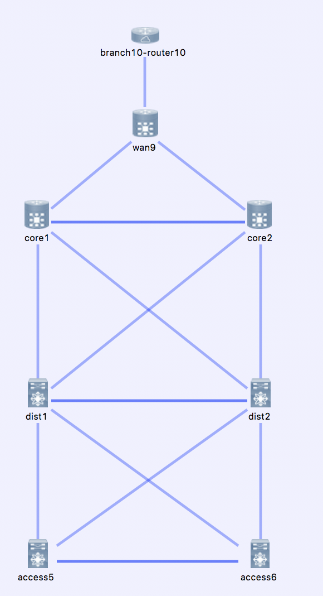

# datacenter

A classic data center design with core/distribution/access layer

The following device types are used for this topology:

* Branch Router - IOS-XE
* WAN - IOS-XR
* Core Layer - IOS-XR
* Distribution Layer - NX-OS
* Access Layer - NX-OS
## Topology




## Usage

If you are using [virlutils](https://github.com/kecorbin/virlutils) you can
instantiate this topology by simply typing

```
virl up virlfiles/datacenter
```

If you are launching your simulation by some other means, you will want
to download the topology.virl file, and import modify it by changing the
`{{ gateway }}` tags to reflect your current VIRL environment.
